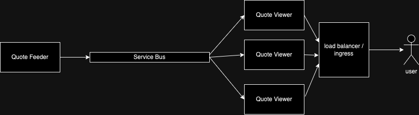

# Quotes Viewer - A k8s Demo

## 1. The Project


### 1.1. About
This project demonstrates the use of Kubernetes to deploy a complex application consists
of multiple services and a service bus. As a use case we want to display stock quotes on
a page. These quotes are produced by a feeder and displayed real-time on the page.

Why do I create this project? The objective is to have a working example how to
deploy a complete applcation on Kubernetes platform. I intend this to be an ongoing
project which I will continuously adding Kubernetes features. 

First, we will review the architecture of the application. 



We will begin on the left side, the Quote Feeder. This module generates
the quotes and puth them on the service bus. Basically it can be any service bus,
and in this case we will use RabbitMQ.

On the consumer side we have the Quote Viewer, which is also a web server. To demonstrate
the scalibility, we deploy this server in multiple replicas. The user will access the server
through a load balancer. For this purpose, we designed the RabbitMQ to behave as a pub/sub
model with a fanout behaviour.

Both the Quote Feeder and Quote View are developed using .Net 6. Initially the Quote Feeder will
start with pre-defined stock quotes. It will generate random quote changes for each stock.
These new quotes are then published to the service bus.

The Quote View consumes the message from the service bus and will send the updates to
all existing SignalR connections.

### 1.2 Challenges
Creating the deployments and services for this project is quite straight forward following
existings examples on the net. Difficulties came when I began to implement Ingress. First,
I need to grasp the concept how Kubernetes cluster works and how you apply Ingress in it. When
I use Ingress, the cluster will create an entry point on port 80. Ingress itself acts
as a load-balancer and a routing machine. Since the routing depends also on the 
hostname, testing this on a local machine is quite tricky for a first-timer. This setup 
works on my machine, only when I add the host routing on my `hosts` file:
```shell
127.0.0.1 quotesview.demo
```

The next challenge I faced is that the routing to static files from within the .Net 
application does not work in combination with Ingress. I decided to serve the HTML content
through a controller and search how the combination of Ingress and static-files later.
But, the combination of controller and Ingress works for now and it will do for me for now.

I was also facing the difficulties with CORS. In theory, the web server which also servers
the SignalR connection, servers both connection through the same host/domain. But somehow,
I got CORS refusal. For now I solve this by making CORS exceptions from withtin the application.
For now I'm satisfied for this workaround, but it's a subject for further investigation.

The last challange I faced, which took me several days to fix, was that Ingress refused
the SignalR negotiation. Apparently I need to tweak the Ingress settings to allow CORS
and to allow all types of methods to go through; and this was not allowed by default.

### 1.3. Final Words

I am hoping that this project will be useful for those who wanted to start learning Kubernetes,
specially those who also develop in .Net.
-----------------
Tags: **#kubernetes**, **#k8s**, **#DOTNET**, **#C#**, **#RabbitMQ**, **#SignalR**, **#ASPNET**.

## 2. Technical Insight
As an example we are building an application that displays stock prices from the AEX Index (Amsterdam stock exchange). The application contains 3 parts.

### 2.1 RabbitMQ
We will pull this image directly from the Docker Hub. For testing purposes, we will include the management client of it.

### 2.2 QuoteFeeder
This service will feed the quotes onto the queue. The prices are just a simulation and are not the real prices. The source code is included in this repository. The docker image is also available on Docker hub as `huferry/quote-feeder`.

### 2.3 QuoteView
This service is an HTTP-server that reads the quotes from the queue and sends those to the web-browser. The source code is included in this repository and the docker image is available on Docker hub as `huferry/quote-view`.

## 3. Usage
I assume that Kubernetes is already installed on the machine. In this example, it will use `minikube` and `kubectl`.

**Starting minikube**
Make sure you have the `minikube` started.
```
minikube start
```

**Create The Secrets**
For RabbitMQ, the credentials are:
- username: quotes.user
- password: ToP$3cret!
  
How we get the base64 encoding:
```
echo -n "your secret" | base64
```
Create the secrets on kubernetes:
```
kubectl create -f ./k8s/00-secrets.yml
```

**Create deployment**
First create the RabbitMQ instance. After the deployment is created, an instance of RabbitMQ will run in a pod. This will not available from outside the pod until a service is created.
```
kubectl create -f ./k8s/01-queue-deployment.yml
```

**Check if pods is running**
```
kubectl get pods
kubectl describe pod <podname>
```

**Create service**
Create the service of RabbitMQ, exposing the management client to simplify testing. By creating a service, we expose the ports from outside the pod. The service will have it's own IP address, and the following step shows us how to reveal this IP address.
```
kubectl create -f ./k8s/02-queue-service.yml
```

**Check Exposed IP address & ports**
This will show the IP address/ports exposed. The first one will be the AMQP port and the second one the management page. In some cases, `minikube` is unable to create its own IP address, in this case it will use the `localhost` and choose another port numbers. 
```
minikube service quotes-amqp-service --url
```

**Create the feeder**
When the feeder is runing, the queue will be fed with quotes.
```
kubectl create -f ./k8s/03-feeder-deployment.yml
```

**Create the viewer**
If the feeder is running, the viewer can be deployed.
```
kubectl create -f ./k8s/04-view-deployment.yml
```

**Create the service for the viewer app**
Run this command to create the service:
```
kubectl create -f ./k8s/05-view-service.yml
```

**Open the viewer on the browser**
Run `minikube service` to expose the URL, then navigate to the URL.
```
minikube service quotes-view-service --url
```

**Using Ingress**
Enable Ingress addon on `minikube`:
```
minikube addons enable ingress
```
Add the Ingress object:
```
kubectl create -f ./k8s/06-ingress.yml
```
Create tunnel in `minikube`
```
minikube tunnel
```
Add this line to `/etc/hosts`:
```
127.0.0.1 quotesview.demo
```
Naviagate the browser to http://quotesview.demo


**Cleanups**
```
kubectl delete deployment quotefeeder-deployment
kubectl delete service quotes-amqp-service
kubectl delete deployment quotes-amqp-deployment
kubectl delete secret quotes-secrets
```


